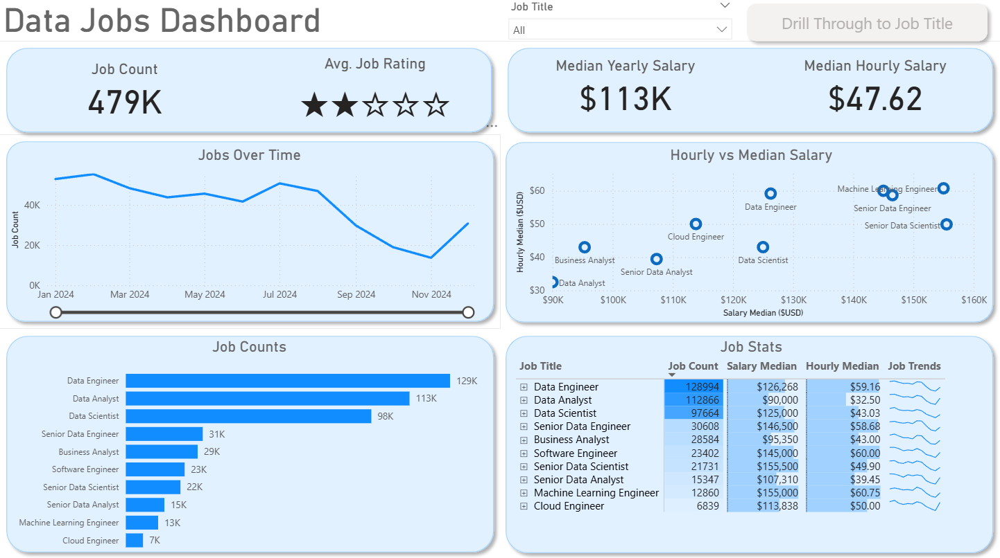
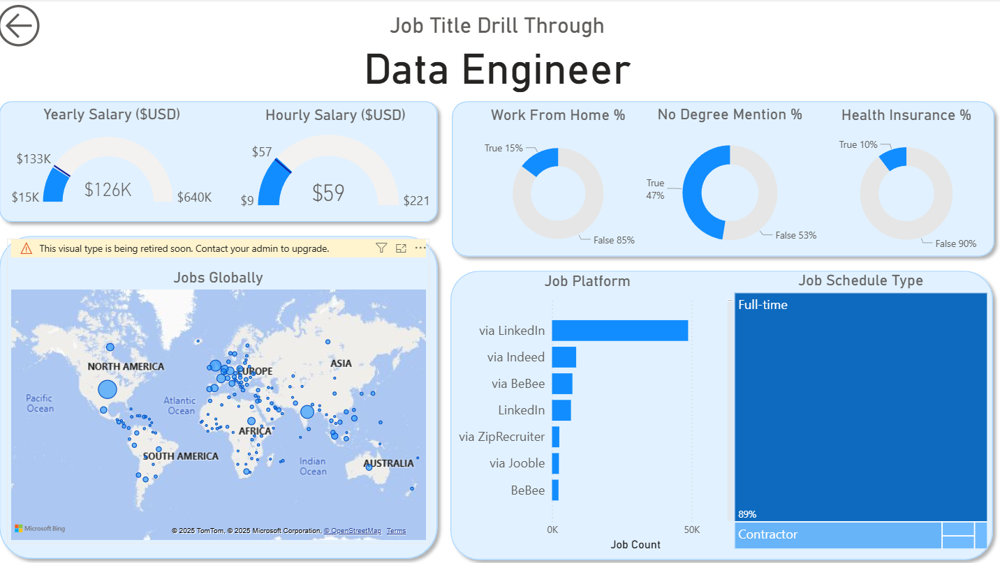

# 📊 Power BI Job Market Analytics Dashboards

  

## 📖 Project Overview
This repository showcases two Power BI dashboards that I independently built by following a real-world portfolio project from Luke Barousse. The goal of this project was to gain hands-on experience with advanced Power BI development techniques, including ETL with Power Query, data modeling, DAX calculations, and dashboard interactivity.

Although inspired by Luke Barousse’s work, **every step was implemented manually inside Power BI Desktop**, including data transformation, modeling, visualization, and interaction setup — ensuring full technical understanding and reproducibility.

---

## 🎯 Project Objectives

- Practice end-to-end dashboard development using Power BI
- Strengthen practical skills for **data analyst / business intelligence roles**
- Apply industry-standard techniques in data cleaning, modeling, and visualization
- Build portfolio-ready dashboards as part of career preparation

---

## 📁 Repository Structure

```text
powerbi-job-market-portfolio/
├── dashboard1/
│   ├── Job_Market_V1.pbix
│   └── screenshots/
│       ├── page1_high_level.png
│       └── page2_drillthrough.png
├── dashboard2/
│   ├── Job_Market_V2.pbix
│   └── screenshots/
│       └── dashboard_single_page.png
└── README.md

> **Note:** `.pbix` files are stored using **Git LFS** due to GitHub’s 25MB upload limit.

---

## 📊 Dashboard 1 – Job Market Insights (Version 1)

A two-page design offering both high-level overview and job title drill-through analysis.

### ✔ Key Features
- Job count and median salary overview  
- Filterable job title analytics  
- Global hiring location map  
- Drill-through deep-dive page  
- Buttons & bookmarks for interactive navigation  
- Slicers for dynamic filtering  

📸 **Screenshots**




---

## 📈 Dashboard 2 – Optimized One-Page Insights (Version 2)

A refined version focused on compact insights and decision-making efficiency.

### ✔ Key Features
- One-page fully interactive dashboard  
- Skills per job & salary benchmarking  
- Role comparison visuals  
- KPI cards and trend charts  
- Best suited for quick market assessment  

📸 **Screenshot**


---

## 🛠 Key Technical Skills Demonstrated

| Skill Area | Techniques Used |
|------------|-----------------|
| **ETL** | Data cleaning & transformation using Power Query |
| **Modeling** | Star schema, relationship design |
| **DAX** | KPI measures, aggregation, dynamic calculations |
| **Visualization** | Bar, column, map, card, table |
| **Interactivity** | Drill-through, slicers, bookmarks, buttons |
| **Design** | UI optimization, color consistency & layout strategy |

---

## 📎 PBIX File Access

This repository uses **Git LFS (Large File Storage)** to manage `.pbix` files due to GitHub’s size restriction.

🔹 To download and use the dashboard files:
1. Clone the repo using Git LFS  
2. Open `.pbix` files in **Power BI Desktop**  
3. Interact with slicers, drill-through, and visuals

If you’re unable to access the file or prefer receiving it directly, feel free to contact me.

---

## 📬 Contact

💼 Open to opportunities related to **Data Analysis / BI / Analytics Engineering**

📧 Email: *your-email@example.com*  
🔗 LinkedIn: *your-linkedin-profile*

---

⭐ *If you found this project valuable, feel free to star the repo or connect with me on LinkedIn!*

